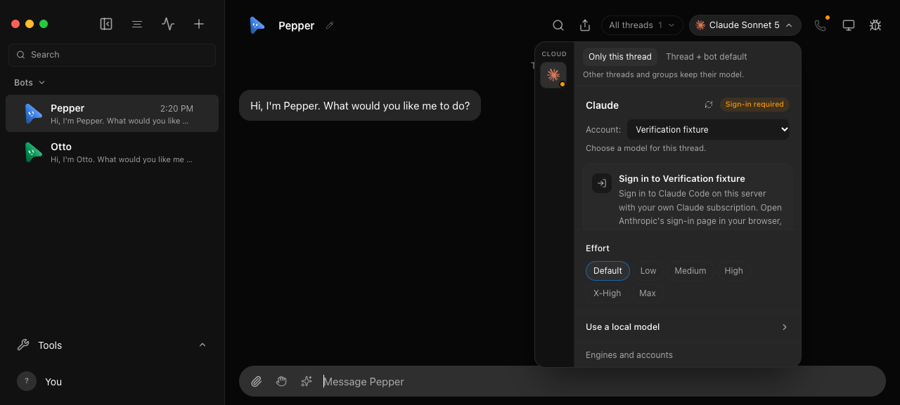
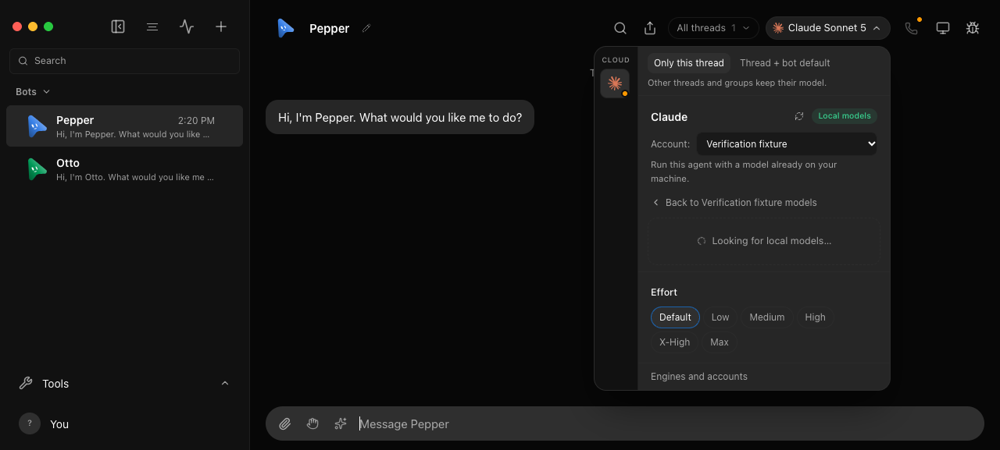
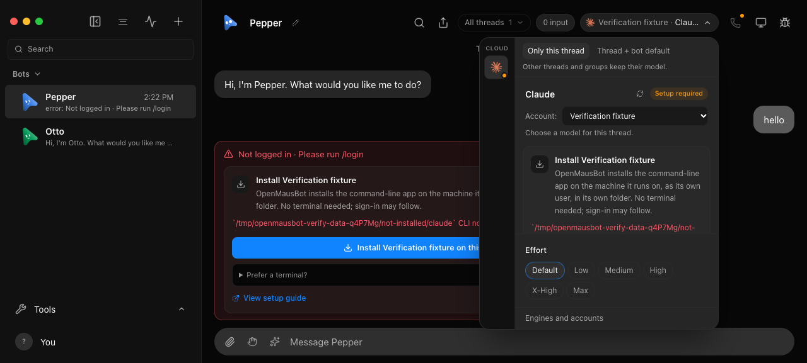

# Bot setup, model scope, and file continuity

```sh
pnpm exec vitest run server/setup-mode.test.ts server/bot-setup.e2e.test.ts server/bot-continuity.e2e.test.ts server/independent-threads-api.test.ts
OMB_UI_E2E=1 pnpm exec vitest run scripts/testing/control-omb-ui.e2e.test.ts
pnpm exec electron scripts/smoke-approval-modes.cjs --model-ui-only
```

The server recipe launches the real app in a temporary home with only the
offline CLI. It sends actual messages through `control-omb`, waits for settled
turns, and checks the prompt and model delivered to the provider boundary:

- A named bot with no description or SOUL can receive a normal work request
  without the setup interview or its "Wait for a yes" instruction.
- `/setup Help me track garden watering` explicitly enables coaching; the next
  ordinary request disables it, even if no profile card was confirmed.
- A pinned thread's model change with `updateBotDefault: true` updates that
  thread and the bot default used by groups and future threads. It does not
  change a selected sibling, other saved model choices, or approval levels.
- Without that flag, only the selected thread changes. Group dispatch still
  uses the bot default. Busy group changes and invalid requests are rejected.
- Direct and room prompts carry the same saved identity and standing rules,
  plus explicit current/shared/sibling file locations. Old files are retained;
  working-directory pins and concurrent-thread isolation do not change.

The test prints a retained `.bot-continuity.json` evidence path with commands,
wait results, bounded transcripts, and provider-input receipts. Launch
environments and MCP tokens are not retained. The renderer recipe checks both
scope buttons in the real model picker, saves a screenshot, changes models,
checks server persistence, and sends a message through the composer.

The header starts at **Only this thread**; **Thread + bot default** explicitly
includes group turns and future threads. The desktop model-switch recipe uses
the real picker and private approval channel against offline providers. It
checks Cancel, the 390px confirmation layout, switching a Custom Codex thread
to Claude with Ask in one confirmed operation, then updating a mismatched bot
default without changing another existing Custom thread. HTTP cannot bypass
Custom; ordinary Full switches may use the atomic HTTP downgrade. A fresh
thread adopts the new default, and a sample engineering-handoff request sent
through the composer completes with the fake provider reply. Screenshots stay
in `.omb-scratch/verify-evidence/model-switch/`. This proves settings and turn
dispatch, not the quality of a real model's engineering output. The store test
also simulates a failed disk write and confirms neither scope changes.

The picker smoke also includes an installed but signed-out Claude account and
a missing Codex installation. The signed-out account stays in the picker's
**Account** list; choosing it shows its sign-in card and **Use a local model**,
never its cloud models. The missing Codex, which no bot uses, stays in Settings
only, and the picker keeps an **Engines and accounts** shortcut. A missing
engine that a bot already runs on stays in that bot's picker with its install
card, so the model never silently vanishes. `src/lib/engine-rail.test.ts`
covers these rules for each Claude account, empty catalogs and leaving the
source catalog unchanged. `src/components/ModelPicker.interaction.test.ts`
opens the real picker component and checks the sign-in and install cards, that
no cloud model can be picked on a signed-out account while its local models
still can, and that opening local models re-probes local servers behind a
**Looking for local models…** status that ends after five seconds at most.
The smoke selects a configured local Codex model, browses Claude, closes and
reopens the picker, and checks that the selected local model is visible again.

### Signed-out Claude in the picker — 2026-09-26

After a Discord report that Claude could no longer be selected, the picker was
checked in the headless renderer (`control-omb ui launch`, a Vite preview and
a headless browser on a disposable fixture; no Electron, no real account):

```sh
FAKE_CLAUDE_AUTH=out node --experimental-strip-types scripts/control-omb.ts ui launch --mode not-logged-in
```

The fake CLI answers `auth status` with `loggedIn: false` and every prompt
with Claude's own "Not logged in" frame. Pepper is on that Claude.

- Opening the picker shows **Claude** on the rail with **Sign-in required**,
  the **Sign in to Claude** card and **Use a local model**; no Claude model row
  is offered. Before this fix the filter returned no engine at all for this
  fixture; that reproduction is now a test in `src/lib/engine-rail.test.ts`.
- **Use a local model** sent one `POST /api/instances/claude/refresh-models`
  and showed **Looking for local models…** (held for three seconds by delaying
  that request in the page), then **No local models found**.
- Sending `hello` on the signed-out Claude ends in the existing setup error
  with the **Sign in to Claude** card, not a silent failure.
- Two more accounts were added through `POST /api/instances/claude-accounts`.
  **Spare** and Pepper's own account were then pointed at a missing CLI with
  `PATCH /api/instances/:id`. The picker kept Pepper's account with its
  install card and the CLI-not-found reason, kept the signed-out, unused
  **Work** account (choosing it showed its sign-in card and did not change
  Pepper's model), and left **Spare** out.
- The browser console had no errors.

This proves the renderer and the fixture server's instance catalog. It does
not prove a real Claude Code sign-in, a real Ollama or LM Studio server, or
the Electron shell, and it is not a production qualification. The Electron
picker smoke's assertions were updated for these rules but were not run for
this change.







## Live Claude smoke — 2026-09-12

Separately, the exact system prompts captured from the disposable app were
replayed to the signed-in Claude CLI (Sonnet 5). These were synthetic requests,
not live user conversations. `--safe-mode`, `--restricted`,
`--strict-mcp-config` and `--no-session-persistence` disabled customizations and
saved sessions. Tools were disabled except for the final test, which allowed
only Read inside the disposable working directories.

| Request | Observed response |
| --- | --- |
| `What is 17 + 25? Answer with the number.` | `42` |
| Explicit setup for tracking garden watering | Asked about the job, timing, apps and folder |
| Find `garden-plan.txt` from earlier work, outside the current directory | Read the shared-bot file and returned its hidden verification code, `MOSS-42` |

An arithmetic control using the old automatic-setup block also answered `42`.
This does **not** reproduce every reported refusal, establish malicious intent,
or prove every provider behaves identically. The verified regression is the
unrequested coaching sent by OMB; live results confirm ordinary work, explicit
setup and cross-folder reading on the tested Claude model. Group model routing
and UI persistence use the offline provider. No real bots or files were moved.
